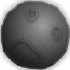

# Asterpocalypse - Asteroid Sınıfı Raporu

## Genel Bakış

**Asteroid Sınıfı**, oyunun temel öğelerinden biri olan asteroitlerin davranışlarını yönetir. Bu sınıf, asteroitlerin rastgele doğmasını, hareket etmelerini, hasar almalarını ve yok olmalarını sağlar. Ayrıca her asteroitin puan, sağlık ve hız gibi özelliklerini belirler ve bu değerleri yönetir. Asteroitler, ekrandaki görselleri ile hareket eder, patlama animasyonları ve hasar alma gibi özelliklere sahiptir.

---

## Temel Özellikler

- **Puan (Points):**
    - Her asteroitin farklı puan değerleri vardır: 10, 20, 30.
  
- **Sağlık (Hitpoints):**
    - Asteroitlerin 3 farklı sağlık değeri bulunur: 1, 2, 3.

- **Görseller (Images):**
    - Asteroitlerin görselleri `images/asteroid0.png`, `images/asteroid1.png`, `images/asteroid2.png`, `images/explosion0.png` ve `images/blank.png` gibi dosyalarla temsil edilir.

- **Hız (Speed):**
    - Asteroitlerin hareket hızı zaman içinde değiştirilebilir. Varsayılan hız 20'dir.

- **Hasar Alma ve Yok Olma:**
    - Asteroitler hasar aldıkça sağlıkları azalır ve sağlık sıfırlandığında patlar (yok olur).

- **Doğma (Spawn) ve Hareket (Movement):**
    - Asteroitler rastgele yerlerde doğar ve ekranın sağ tarafından sola doğru hareket ederler.

---

## Sınıfın Metodları

### 1. `SpawnAsteroid(self)`
   Asteroit görüntüsünü ekranda görünür hale getirir.

### 2. `getSpeed(self)`
   Asteroitin mevcut hızını döndürür.

### 3. `setSpeed(self, speed)`
   Asteroitin hızını belirler.

### 4. `moveAsteroid(self)`
   Asteroitin ekranda sola doğru hareket etmesini sağlar.

### 5. `genYSpawn(self, y1=0, y2=0, x1=0, x2=0)`
   Asteroitin doğma konumunu rastgele belirler ve geçerli bir y konumu üretir.

### 6. `Generate(self)`
   Asteroitin rastgele bir boyut seçmesini sağlar ve bununla birlikte istatistiklerini (sağlık, puan) oluşturur.

### 7. `getyPos(self)` ve `setyPos(self, y)`
   Asteroitin y koordinatını alır ve ayarlar.

### 8. `getxPos(self)` ve `setxPos(self, x)`
   Asteroitin x koordinatını alır ve ayarlar.

### 9. `setAsteroidimg(self, size)`
   Asteroitin resmini belirler.

### 10. `getAstroidimg(self)`
   Asteroitin resmini döndürür.

### 11. `setAsteroidhp(self, size)`
   Asteroitin sağlık değerini ayarlar.

### 12. `getAsteroidhp(self)`
   Asteroitin sağlık değerini döndürür.

### 13. `setAsteroidpoints(self, size)`
   Asteroitin puanını ayarlar.

### 14. `getAsteroidpoints(self)`
   Asteroitin puanını döndürür.

### 15. `getWidth(self)` ve `getHeight(self)`
   Asteroitin genişlik ve yüksekliğini döndürür.

### 16. `destroy(self)`
   Asteroiti yok eder.

### 17. `isdestroyed(self)`
   Asteroitin yok olup olmadığını kontrol eder.

### 18. `undestroy(self)`
   Asteroiti tekrar aktif hale getirir.

### 19. `makeinvis(self, setback=0)`
   Asteroiti ekrandan dışarı çıkarır.

### 20. `TakeDamage(self)`
   Asteroite hasar verir ve yok olup olmadığını kontrol eder.

---

## Görseller

Aşağıdaki görseller `images` klasöründen alınmıştır:

- 
- 
- 
- 
- 

---

## Örnek Kod

#  Asterpocalypse - Bullet Sınıfı Raporu

##  Genel Bakış

**`Bullet` sınıfı**, oyuncu tarafından ateşlenen mermiyi temsil eder. Bu sınıf, merminin hareketini, görselliğini ve ekran üzerindeki davranışını kontrol eder.

---

##  Temel Özellikler

| Özellik         | Açıklama |
|-----------------|----------|
| `__x`, `__y`    | Merminin x ve y konumlarını belirtir. |
| `__width`, `__height` | Mermi görselinin genişlik ve yüksekliğini belirtir. |
| `__fired`       | Mermi ateşlenmiş mi kontrolü yapılır (boolean). |
| `__timerid`     | `after()` ile yapılan animasyonu kontrol eden zamanlayıcıdır. |
| `__canvas`      | Merminin çizildiği tkinter Canvas nesnesi. |

---

##  Kullanılan Görseller

| Amaç                         | Görsel |
|-----------------------------|--------|
| Mermi görseli (ateşlenmiş)  |  |
| Boş görsel (resetlenmiş)    |  |

---

##  Metotlar ve Açıklamaları

### `__init__(self, canvasarg)`
Mermi nesnesi oluşturulur. Görseller yüklenir, başlangıç konumu atanır ve mermi canvas'a yerleştirilir.

---

### `getX()` / `getY()`
Merminin güncel koordinatlarını döndürür.

